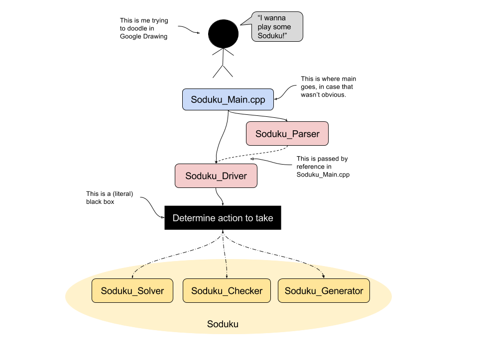

# Soduku
A Soduku solver, checker and generator for Soduku puzzles an any size.. Written 
entirely in c++. 

The rules of Soduku puzzle is well defined: find numbers from 1 to 9 to fill in
the grid so that each number appears once and only once in every row, column, 
and 3 by 3 subgrid. This has always been an appealing number game. But as easy 
as the rules may seem, a Soduku puzzle can be mind boggling at times. I wrote 
this program because I wanted to see if a computer can do better than me. And 
it sure did.

# So what is this?
The main and most interesting functionality of this program is solving a soduku 
puzzle. It can solve any provided sokudu puzzle in the form of a n^2 by n^2 
grid of integers, where n is a postive integer, with the number 0 serving as a 
placeholder for blank grid cells. 

For example, if we run the following Soduku puzzle in this program:
```
0 0 3 0 2 0 6 0 0 
9 0 0 3 0 5 0 0 1 
0 0 1 8 0 6 4 0 0 
0 0 8 1 0 2 9 0 0                   
7 0 0 0 0 0 0 0 8 
0 0 6 7 0 8 2 0 0 
0 0 2 6 0 9 5 0 0 
8 0 0 2 0 3 0 0 9 
0 0 5 0 1 0 3 0 0 
```
Then we would get the following result printed with pretty gridlines in a 
heartbeat:
```
|-----------------------| 
| 4 8 3 | 9 2 1 | 6 5 7 | 
| 9 6 7 | 3 4 5 | 8 2 1 | 
| 2 5 1 | 8 7 6 | 4 9 3 | 
|-----------------------| 
| 5 4 8 | 1 3 2 | 9 7 6 | 
| 7 2 9 | 5 6 4 | 1 3 8 | 
| 1 3 6 | 7 9 8 | 2 4 5 | 
|-----------------------| 
| 3 7 2 | 6 8 9 | 5 1 4 | 
| 8 1 4 | 2 5 3 | 7 6 9 | 
| 6 9 5 | 4 1 7 | 3 8 2 | 
|-----------------------| 
```

1. [Usage](#usage) 
2. [Design](#design)
3. [Algorithms](#algorithms)
4. [Data Structures](#data-structures)
5. [Testing](#testing)
6. [Project Deviation](#project-deviation)
7. [Acknowledgements](#acknowledgements)
8. [Time spent doing this project](#time-spent-doing-this-project)

## Usage
First, compile with `make` or `make soduku`.
### Mandatory flags
```
Usage: ./run_soduku [--solve     | -s  <filename>] \
                    [--solve-all | -sa <filelist>] \
                    [--check     | -c  <filename>] \
                    [--check-all | -ca <filelist>] \
                    [--generate  | -g  <some number>]
```
### Solve
You can either solve one puzzle or solve a bunch of puzzle. 
To solve one puzzle, you must provide the name of the file that contains a 
Soduku puzzle in the following format:
```
0 6 2 3 4 0 7 5 0 
1 0 0 0 0 5 6 0 0 
5 7 0 0 0 0 0 4 0 
0 0 0 0 9 4 8 0 0 
4 0 0 0 0 0 0 0 6 
0 0 5 8 3 0 0 0 0 
0 3 0 0 0 0 0 9 1 
0 0 6 4 0 0 0 0 7 
0 5 9 0 8 3 2 6 0 
```
Suppose the puzzle name is called `my_puzzle.txt`. We can solve it using 
`--write` or `-w`:
```
./run_soduku --write my_puzzle.txt
```
By default, the solutions will be printed to terminal. You can change that,
however, by using the optional flag `--hide` or `-h`. But wait, what are you 
gonna do with solutions that you can't see, hear, feel ... you can write them 
to a file! To do that, use the flag `--write` or `-w`, followed by the 
directory to write to. 

For example, suppose you want to solve the puzzle, hide the output, and write
the solutions to the current directory:
```
./run_soduku --solve my_puzzle.txt --hide --write .
```
The solution file `my_puzzle_solution.txt` can be found in the current 
directory. 
You can also display the outputs *and* write to file, just omit the `--hide` 
command in the above example.
### Solve a bunch
Alternatively, you can solve a bunch of puzzles at once. To do this, you must 
provide the name of the file that contains the *filenames of the puzzles*. For
example, if `puzzle_list.txt` contains names to a bunch of soduku puzzles:
```
./run_soduku --solve-all puzzle_list.txt --write allsolutions --hide
```
This will write the solutions to all the puzzles listed in `puzzle_list.txt`
to the directory `allsolutions`, provided that the directory exists. There will
also be an additional file called `puzzle_list_solutions_list.txt` in `
allsolutions` that contains the name of all the file generated.
### Check
You can also check the validity of solved puzzles.  
```
./run_soduku --check my_puzzle_solution.txt
```
### Check a bunch
Check a bunch of puzzles given the file that contains the filenames of these
puzzles:
```
./run_soduku --check allsolutions/puzzle_list_solutions_list.txt
```
The output to terminal will indicate the validity of the puzzles checked.

### Generate
To generate a Soduku puzzle, use `--generate` or `-g`:
```
./run_soduku --generate
```
This will randomly generate a 9 by 9 puzzle, which will be printed to terminal.

### Generate a bunch 
You can also feed `--generate` an optional second argument, which must be a 
positive integer. This will tell the program to generate that number of puzzles.

Of course, you guessed it, you can write the generated puzzle to file! Suppose 
you want to generate 10 puzzles, write the solved puzzles to a directory called
`allpuzzles`, and hide the output:
```
./run_soduku --generate 10 -w allpuzzles -h
```
The list to the filenames of the generated puzzles will be called 
`puzzle_list.txt` and will be located in the directory `allpuzzles`.

You can also generate Soduku puzzles of arbitrary size -- well, not really. 
This size has to be a perfect square of another integer, due to the way Soduku 
puzzles are constructed. To do this, use the flag `--size` or `-n` and follow 
up with an integer. You can specify the difficulty of the Soduku puzzle as 
well. Difficulty is determined by the number of indeterminate values in the 
puzzle. A `hard` puzzle will have approximately 80% of the values removed, a 
`medium` puzzle will have 50% removed, and an `easy` puzzle will only have 30% 
removed. The default size is 9 and difficulty is `medium`. 

Put together, if we want to generate 15 puzzles 16 by 16 in size that are 
`hard`, hide the output and write to the directory `reallyhardpuzzles`:
```
./run_soduku -g 15 --difficulty hard --size 16 -w reallyhardpuzzles -h
```
Now go find your puzzles in `reallyhardpuzzles`!

**That's pretty cool! I'm curious to see what's happening behind the scenes 
though...**

So did I! You can visualize the solving and generating process for any solve or 
generate commands by adding the flag `--show` or `-s`. Beware: the program is 
forced to sleep for 0.1 seconds before each re-print so you have time to see 
the output. This may significantly slow the runtime. You cannot, however, use 
`--show` in conjunction with `--hide`. That just doesn't make much sense.

## Design
The `main` function resides in `Soduku_Main.cpp`. It first creates a 
`Soduku_Parser` object to parse command line arguments, then creates a 
`Soduku_Driver` object to invoke a driver function. Depending on the command
line arguments, `Soduku_Driver` will create a `Soduku_Solver`, 
`Soduku_Checker`, or `Soduku_Generator` object.

`Soduku_Solver`, `Soduku_Checker` and `Soduku_Generator` are all derived 
classes of `Soduku`. While they do vastly different things, some of the 
variables and functions are shared amongst two or all of them. The `Soduku` 
class on its own, however, is useless.

In a nutshell:



In addition, `Soduku_Util` contains helper function that may be shared across 
multiple `Soduku*` files.

## Algorithms

Each grid cell in a Soduku Puzzle is an instance of the  `Coord` object (see 
[Coord](Coord/)). It holds two integers `x` and `y` that indicates the 
coordinates of this object in the grid, indexed from zero. In a typical 9 by 9 
Soduku puzzle, there are 81 `Coords`, going from `(0, 0)`, `(0, 1)` ... to 
`(8, 8)`. A unit is defined to be a row, column or subgrid. Every `Coord` in 
the grid is contained in three different units. In a 9 by 9 puzzle, each unit 
must contain one and only one of the numbers of from 1 to 9.

### In solving a puzzle
This is a [constraint satisfaction problem][1]. Every grid cell must satisfy 
that constraint that it cannot have a value that already exists in any of its 
three units. [Constraint propagation][2] is used in conjunction with a 
[depth-first backtracking search][3] algorithm to find a solution or partial 
solution if the solution does not exist. First, prune the grid so that each 
grid cell holds a list of legal possible values that does not contradict with 
any existing values. For example, if puzzle says that `(0, 0) = 5`, then 
`(0, 1)` can't be 5, so we eliminate 5 from  `(0, 1)`. This is called 
constraint propagation.

Sometimes, for simpler puzzles, a solution can be found after pruning the 
grid. Other times, we need to go through a trial-and-error process by picking a
grid cell, assigning it a value from its pool of legal values, and then 
recursively repeat until either the puzzle is solved or if a contradiction is 
found, in which we backtrack to the previous level and try a different value. 
This is called depth-first backtracking search. 

The value selected at each recursion is picked according to the minimum 
remaining value heuristic. That is, the grid cell that contains the least 
number of legal remaining values is picked first. This grid cell is also called
the most constrained variable.

To expedite the process, at each level of search recursion, constraint 
propagation is again enforced. There are two simple rules of thumbs: 

1. if a grid cell has only one value `d` left in its pool of legal values, 
then that grid cell should be assigned to `d`. 
2. For every unit, if a value `d` can be found in only one grid cell, 
then that grid cell must be assigned to `d`. 

Either case, we remove `d` from the domains of all other grid cells in the
concerning gird cell's row, column, or subgrid.

### In checking a puzzle
First, initialize a container than holds all the possible values for each unit. 
For a 9 by 9 puzzle, that would be a container of 27 units, each holding 9 
numbers from 1 to 9. Then, iterate through all the grid cells in the puzzle. For 
each seen value, eliminate that value from the three units that contains that 
grid cells. Check that removal is always successful and that at the end of the 
iteration all the units are empty.

### In generating a puzzle
Puzzle generation is done via a depth first backtracking search with randomness.
A puzzle is generated by iterating through all the grid cells in the puzzle and 
assigning each a random but legal value based on existing assignments. If no 
values at this level of recursion works, backtrack to a previous level and try 
with a different value. 

## Data Structures 

The data structures I implemented for this program are

1. [Set](Set/)
	
	This is an ordered collection of unique elements, implemented as an 
    [AVL tree][4], a type of self-balancing binary search tree. The benefits of 
    using this container is the fast O(n) look up time, which comes at the cost
    of slower insertion and removal.


2. [Hash Table](HashTable/)
	
	This is an unordered collection of elememts (or values) indexed by keys. 
    Because values are indexed by keys, keys must be immutable, meaning they 
    cannot be changed. Values, however, can be changed or overwritten. Keys 
    should therefore be unique to ensure that no data is lost. Hash collision 
    is resolved by chaining.

3. [Linked List](LinkedList/)

    This is the linked list used in the Hash Table. 

Other data structures I used throughout the program include STL vector, stack, 
and queue.

## Testing
To compile the test for the main program, first do `make` or `make soduku`, 
then do `make test` in this directory. Run the test with `./test_soduku`. The 
test file is called `Soduku_Tester.cpp`. This test generates a bunch a puzzles,
solves the generated puzzles, and then checks the validity of the solutions. 
However, because generating new puzzles of size 16 or 25 may take unnecessarily
long and is subject to chance, the generating option is turned off by default. 
To generate new puzzles, run `./test_soduku [--generate | -g]`. Running the 
test without generating would still work because there exists previously 
generated puzzles. 

The unit tests for each container are located in their subdirectories. 

### Testing data 
Some test data already exists in `data/puzzles/`.

1. `set1` contains 50 puzzles obtained from [Project Euler][5]. 
2. `set2` contains 300+ puzzles obtained from [here][6]. 

The rest of the puzzles are generated by `Soduku_Generator` in previous 
runs of the test

3. `set3` contains 10 easy puzzles of size 9 by 9.
4. `set4` contains 100 hard puzzles of size 9 by 9.
5. `set5` contains 50 medium puzzles of size 16 by 16.
6. `set6` contains 5 medium puzzles of size 25 by 25.

All of the solutions can be found in `data/solutions`. 

## Project Deviation
Originally, I planned to implement a priority queue to hold my grid cells. I 
thought this would be useful when I want to select the most constrained 
variable, as the grid cells will be ordered according to their number of legal 
remaining values. However, in order to allow for backtracking, each search state 
has to hold a separate copy of all the values in the grid cells. Additionally, 
constraint consistency is enforced after every successful new assignment, 
which will result in elimination of a lot of domains from a lot of grid cells. 

This means that if I were to use a priority queue to hold my grid cells, I 
would need to regenerate a new priority queue at each search state. However, 
this is huge waste of memory and time, since I only care about the element at 
the top of the priority queue. All of the remaining elements are discarded 
as their priorities no longer apply at a new search state. For these 
reasons, I decided to forgo priority queue and use a simple min-finding 
function to select the most constrained variable. 

## Acknowledgements
I would like to thank all the help I received directly and indirectly on Stack 
Overflow, cplusplus.com, geeksforgeeks.org, etc. I would also like to thank the
instructors of UC Berkeley CS188 Intro to AI, Dan Klein and Pieter Abbeel,
for sharing their [lecture slides][7] on CSP (constraint satisfaction 
problems),as well as Peter Norvig for his [insightful article][8] on solving 
Soduku puzzles in Python. Last but not least, I'd like to thank my TAs Erica, 
Max and Justin for all the love and support.

## Time spent doing this project
Too long. But in retrospect, I totally would do it again. 

One of the most challenging parts of this project was trying to figure out how
to add iterating functionality to my data structures, which I wish we learned 
more about in class, as I think this is a very useful feature for data 
structures. But by forcing myself to figure out how to implement iterators, I 
learned more about classes in c++ these past few days than I ever did before, 
which was a very rewarding process. 


[1]: https://en.wikipedia.org/wiki/Constraint_satisfaction
[2]: https://en.wikipedia.org/wiki/Local_consistency
[3]: https://en.wikipedia.org/wiki/Backtracking
[4]: https://en.wikipedia.org/wiki/avl_tree
[5]: https://projecteuler.net/problem=96
[6]: http://forum.enjoysudoku.com/the-hardest-sudokus-new-thread-t6539.html
[7]: http://ai.berkeley.edu/lecture_slides.html
[8]: http://norvig.com/sudopy.shtml